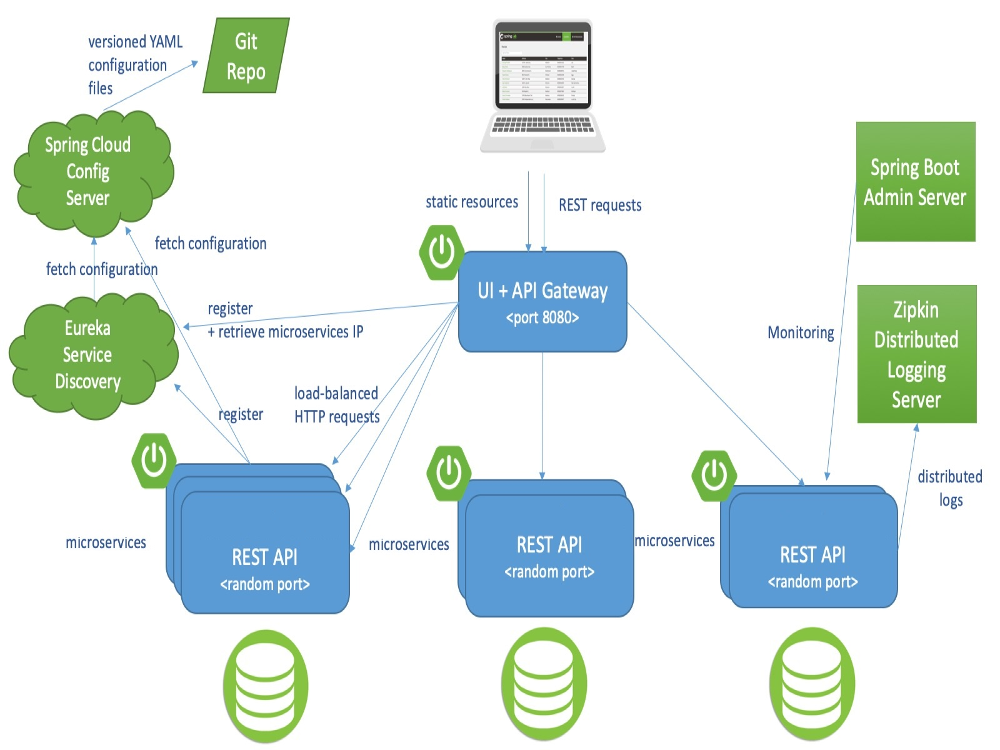
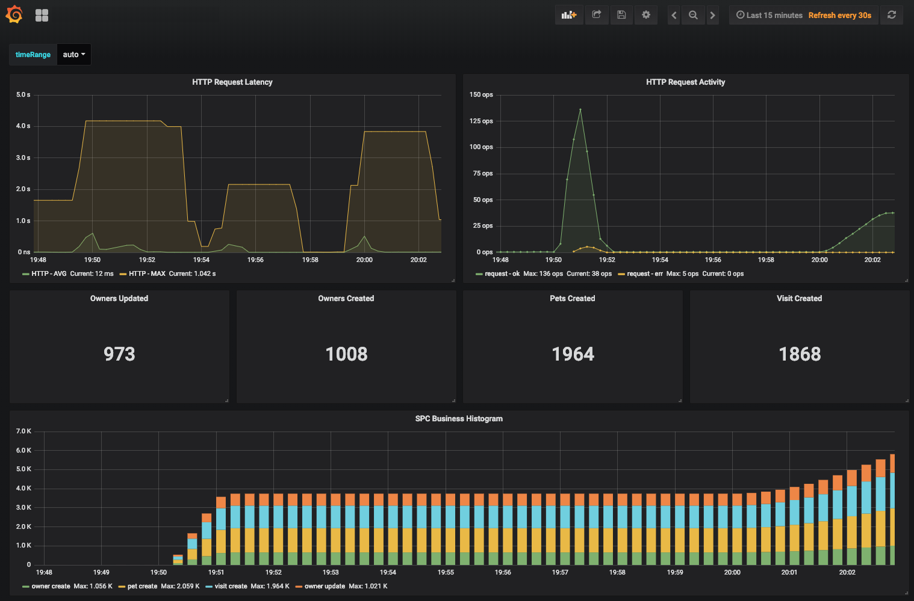

# MVP Microservice Application built with Spring Cloud

Microservices is an architectural style that has been adopted by many organizations like Netflix, Amazon and so on. Microservices architecture technically just structures the entire application as a collection of autonomous services that are loosely coupled, independently developed as well as deployed, highly maintainable, and testable. It allows the organizations to evolve in the technology stack as per the required functionality of the application.

> The term "Microservice Architecture" has sprung up over the last few years to describe a way of designing software applications as suites of independently deployable services. While there is no precise definition of this architectural style, there are certain common characteristics around organization around business capability, automated deployment, intelligence in the endpoints, and decentralized control of languages and data – **Martin Fowler**

### The most common features of the Microservices architecture are:

*   Governance – As there is no centralized governance, there is a freedom for the developer to choose the best tools for each service and to resolve issues. 
*   Agility – Microservices have agile development as new features and updates can easily be added to the services. 
*   Microservices are individual components that can be easily upgraded and removed from the application as per the need. 
*   As the application is decoupled, it is easier to build and scale. 
*   It allows the release of different software versions to be systematically automated for software testing, creation and running. 
*   They can be distributed across different cloud servers and databases. 
*   They are modular, loosely coupled components, where each component performs a discrete function. 

Microservice architecture lets us break the application into independent services, each managed by individual software development teams in the organizations. They support the responsibility by building a scaled application, which allows the development of the independent services without interfering with services with other development teams working on the same overall application. 

### Microservices Implementation

Spring Boot is the core technology that is used for microservices implementation. It simplifies the implementation of the tasks of building REST-based microservices. Spring Boot also simplifies mapping HTTP style verbs (GET, PUT, POST and DELETE) to URLs and JSON protocol sterilization to and from Java objects. Also, mapping of java exceptions back to HTTP error codes. 

1. **Cloud Configuration:** Spring Cloud Configuration handles the management of cloud configuration data via centralized configuration which separates the application configuration data with the deployed microservices. It ensures that regardless of any new number of microservices being introduced in the application, their configurations remain the same. The spring cloud config has its property management repository but sometimes it integrates with open source projects like Git, Consul & Eureka. 
2. **Service Discovery:** In spring Cloud service discovery, the physical location of the servers deployed is hidden from the clients and it is consumed using services. Thus, the servers call the business logic for the server using the name assigned to it rather than the physical location of the logic. It also handles the bootstrap services and registration as well as the deregistration of the services. Some of the common examples for the service discovery are Consul and Eureka.
3. **Hystrix and Ribbon:** Spring Cloud relies and integrates heavily on Netflix open source projects. For microservices client resiliency patterns, Spring cloud mixes Netflix Hystrix and Ribbon project. With Netflix Hystrix libraries, it implements the service client resiliency patterns like Circuit breaker as well as bulkhead patterns. With Netflix Ribbon projects, it simplifies integration with the service discovery projects like Eureka, it also helps with the client-side load-balancing of the service calls from a customer. It further allows the client to execute the service calls even when service discovery is not available. 
4. **Zuul Gateway**: Spring Cloud utilizes Netflix Zuul Project for a microservice application to help with the service routing capabilities. Zuul is a service gateway that delegates service requests and assures that all calls to microservices go via a single front controller before the targeted service is called. This results in the centralization of the service calls, which can later help us in enforcing service policies like security authorization, service authentication, content filtering, and routing rules. 
5. **Cloud Stream:** Spring Cloud Stream is a framework for building highly scalable event-driven microservices connected with shared messaging systems. The framework provides a flexible programming model built on already established and familiar Spring idioms including support for persistent pub/sub semantics, consumer groups, and stateful partitions. Using Spring Cloud Stream, we can integrate our microservices with message brokers like RabbitMQ as well as Kafka. It can also build microservices that execute asynchronous events as they occur. 
6. **Sleuth/Zipkin:** Spring Cloud Sleuth helps integrate tracking identifiers into message brokers (RabbitMQ & Kafka) and HTTP calls being used in the microservices. These tracking identities are also known as trace IDs or Correlation, it allows the application to track the transactions flow in the microservices application. In Spring Cloud Sleuth, these tracking IDs are automatically stored in any logging statements of the microservices application. Sometimes, the spring cloud sleuth is combined with logging technology tools like Papertrail (It is a cloud-based logging platform that helps in clustering all the logs in real-time from various microservices into one database) and Tracing tools like Zipkin (It helps in taking data from the spring cloud sleuth and visualizing the flow of the service calls involved in a single transaction).

### Starting services locally without docker-compose:

Every microservice is a Spring Boot application and can be started locally using IDE ([Lombok](https://projectlombok.org/) plugin has to be set up) or ../mvnwspring-boot:run command. 

Please note that supporting services (Config and Discovery Server) must be started before any other application. Start-up of Tracing server, an Admin server, Grafana, and Prometheus is optional. If everything goes well, you can access the following services at a given location:

*   **Discovery Server** - [http://localhost:8761](http://localhost:8761/)
*   **Config Server** - [http://localhost:8888](http://localhost:8888/)
*   **Tracing Server (Zipkin)** - [http://localhost:9411/zipkin/](http://localhost:9411/zipkin/) (we use [openzipkin](https://github.com/openzipkin/zipkin/tree/master/zipkin-server))
*   **Admin Server (Spring Boot Admin)** - [http://localhost:9090](http://localhost:9090/)
*   **Grafana Dashboards** - [http://localhost:3000](http://localhost:3000/)
*   **Prometheus** - [http://localhost:9091](http://localhost:9091/)
*   **ELK Server** - [http://localhost:8282](http://localhost:8282/)
*   **JWT Auth Service** - [http://localhost:8080](http://localhost:8080/)
*   **Hystrix** - [http://localhost:8181](http://localhost:8181/)
*   **Zipkin Server** - [http://localhost:9411](http://localhost:9411/)

You can tell Config Server to use your local Git repository by using native Spring profile and setting GIT_REPO environment variable, for example, Dspring.profiles.active=native -DGIT_REPO=/projects/spring-mvp-microservices-config

### Starting services locally with docker-compose:

To start an entire infrastructure using Docker, you have to build images by executing./mvnw clean install -P build docker from the project root. Once images are ready, you can start them with a single command docker-compose up. Containers' start-up order is coordinated with dockerize script. You can track service availability using the Eureka dashboard available by default at _http://localhost:8761._

The master branch uses an Alpine Linux with JRE 8 as a Docker base. You will find a Java 11 version in the release/java11 branch.

NOTE: Under MacOS or Windows, make sure that the Docker VM has enough memory to run the microservices. The default settings are usually not enough and make the docker-compose up painfully slow_._

### Understanding the MVP application:

1. **Cloud Config Server:** Spring Cloud Config provides server-side and client-side support for externalized configuration in a distributed system. With the Config Server, we have a central place to manage external properties for applications across all environments.**   **
2. **Cloud Eureka Server:** A distributed system typically comprises many services that communicate with each other to perform certain operations. Service discovery is the process of one service dynamically discovering the network location (IP address and port) of another service to communicate with it.
3. **Cloud Gateway Server:** An API Gateway acts as a single-entry point for a collection of microservices. Any external client cannot access the microservices directly but can access them only through the application gateway. In a real-world scenario, an external client can be any one of the three: Mobile Application, Desktop Application, and External Services or third-party Apps. 
4. **Admin Server:** Monitoring microservice applications by using Spring Boot Actuator Endpoint is slightly difficult. Because, if we have ‘n’ number of applications, every application has separate actuator endpoints, thus making monitoring difficult. Spring Boot Admin Server is an application used to manage and monitor all microservices using a single dashboard.

5. **Cloud ELK Server:** The ELK Stack is a collection of three open-source products — Elasticsearch, Logstash, and Kibana.
ELK Stack is designed to allow users to take data from any source, in any format, and to search, analyze, and visualize that data in real time. ELK provides centralized logging that is useful when attempting to identify problems with servers or applications. It allows you to search all your logs in a single place. It also helps to find issues that occur in multiple servers by connecting their logs during a specific time frame.

6. **JWT Auth Server:** JSON Web Token (JWT) is an open standard (RFC 7519) that defines a compact and self-contained way for securely transmitting information between parties as a JSON object. This information can be verified and trusted because it is digitally signed. JWTs can be signed using a secret (with the HMAC algorithm) or a public/private key pair using RSA. This server is used for providing authentication & authorization of all microservice communication.

7. **Hystrix:** Netflix Hystrix allows us to introduce fault tolerance and latency tolerance by isolating failure and by preventing them from cascading into the other part of the system building a more robust distributed application. Netflix also provides a feature to monitor all of the services within the distributed application boundary.
Hystrix stream provides information on a single application, Turbine provides a way to aggregate this information across all installations of an application in a cluster.

8. **Zipkin:** A Java-based distributed tracing application that helps gather timing data for every request propagated between independent services. It has a simple management console where we can find a visualization of the time statistics generated by subsequent services.

9. **Spring Cloud Sleuth:**  A Spring Cloud library that lets you track the progress of subsequent microservices by adding trace and span id’s on the appropriate HTTP request headers. The library is based on the MDC (Mapped Diagnostic Context) concept, where you can easily extract values put to context and display them in the logs.

10. **Custom metrics monitoring:** Grafana and Prometheus are included in the docker-compose.yml configuration, and the public-facing applications have been instrumented with [Micrometre](https://micrometer.io/) to collect JVM and custom business metrics. A JMeter load testing script is available to stress the application and generate metrics: mvp_test_plan.jmx

### Using Prometheus:

Prometheus can be accessed from your local machine at [http://localhost:9091](http://localhost:9091/)

### Using Grafana with Prometheus:

Anonymous access and Prometheus data source are set up. 

A Spring mvpc Metrics Dashboard is available at the URL http://localhost:3000/d/69JXeR0iw/spring-mvpmetrics. You will find the JSON configuration file here: docker/grafana/dashboards/grafana-mvp-dashboard.json.

You may create your dashboard or import the Micrometer/SpringBoot dashboard via the Import Dashboard menu item. The id for this dashboard is 4701.
